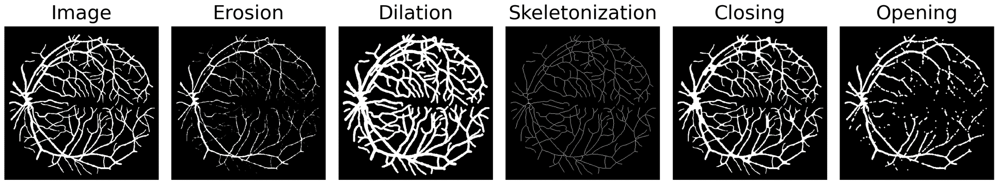

<div align="center">    
 
# Differentiable Soft Morphological Filters for Medical Image Segmentation
 
 <br> 
[](https://conferences.miccai.org/2024/en/)
[](https://creativecommons.org/licenses/by-nc/4.0/)
<br>
Accepted [paper](https://papers.miccai.org/miccai-2024/paper/0322_paper.pdf) at **[MICCAI 2024](https://conferences.miccai.org/2024/en/)**
</div>


* [Abstract](#abstract)
* [Content](#content)
* [Usage](#usage)
* [How to run](#how-to-run)
* [Cite us](#citation)
* [Contact](#contact)


## Abstract
Morphological operations such as erosion, dilation, and skeletonization offer valuable tools for processing and analyzing segmentation masks. Several studies have investigated the integration of differentiable morphological operations within deep segmentation neural networks, particularly for the computation of loss functions. However, those methods have shown limitations in terms of reliability, versatility or applicability to different types of operations and image dimensions. In this paper, we present a novel framework that provides differentiable morphological filters on probabilistic maps. Given any morphological filter defined on 2D or 3D binary images, our approach generates a soft version of this filter by translating Boolean expressions into multilinear polynomials. Moreover, using proxy polynomials, these soft filters have the same computational complexity as the original binary filter. We demonstrate on diverse biomedical datasets that our method can be easily integrated into neural networks either as a loss function or as the final morphological layer in a segmentation network. In particular, we show that the proposed filters for mask erosion, dilation or skeletonization lead to competitive solutions compared to the state-of-the-art.



## Content
This repository contains the code for the soft and differentiable morphological filters used in the paper. 
* `soft_morph_2d.py` : 2D operations for Erosion, Dilation, Opening, Closing and Skeletonization
* `soft_morph_3d.py` : 3D operations for Erosion, Dilation, Opening, Closing and Skeletonization
* `example_usage.py` : example code to apply the soft morphological operations

## Usage
### Input image format
Input images should contain values in the range [0, 1]. Supported dimensions are :
* **2D** images of shape [batch_size, channels, heigth, width] or [height, width]
* **3D** images of shape [batch_size, channels, depth, heigth, width] or [depth, height, width]

### Application
The filters have been tested on  :
* Binary and continuous values ranging between [0, 1]
* In loss function
* As the final layer of a segmentation network

### Filters description
* ***SoftErosion*** : Erode the foreground 
    * <u>init parameters</u> (*max_iter* = number of times the morphological operation is repeated, *connectivity* = structuring element [4, 8] in 2D and [6, 18, 26] in 3D)
    * <u>forward parameters</u> (*image* = input image)
* ***SoftDilation*** : Dilate the foreground
    * <u>init parameters</u> (*max_iter* = number of times the morphological operation is repeated, *connectivity* = structuring element [4, 8] in 2D and [6, 18, 26] in 3D)
    * <u>forward parameters</u> (*image* = input image)
* ***SoftClosing*** : Dilation followed by an Erosion
    * <u>init parameters</u> (*max_iter* = number of times each morphological operation is repeated, *dilation_connectivity* = structuring element [4, 8] in 2D and [6, 18, 26] in 3D for dilation operation, *erosion_connectivity* = structuring element for erosion)
    * <u>forward parameters</u> (*image* = input image)
* ***SoftOpening*** : Erosion followed by a Dilation
    * <u>init parameters</u> (*max_iter* = number of times each morphological operation is repeated, *dilation_connectivity* = structuring element [4, 8] in 2D and [6, 18, 26] in 3D for dilation operation, *erosion_connectivity* = structuring element for erosion)
    * <u>forward parameters</u> (*image* = input image)
* ***SoftSkeletonizer*** : Repeated thinning operation to extract the centerline of the foreground
    * <u>init parameters</u> (*max_iter* = number of repeated thinning operation)
    * <u>forward parameters</u> (*image* = input image)

## How to run
### Dependecies
You'll need a working Python environment to run the code. 
The recommended way to set up your environment is through the [Anaconda Python distribution](https://www.anaconda.com/products/distribution)
which provides the `conda` package manager. 
Anaconda can be installed in your user directory and does not interfere with the system Python installation.
### Configuration
- Download the repository: `git clone https://github.com/lisaGUZZI/Soft-morph`
- Create the environment: `conda create -n soft_morph python=3.9`
- Activate the environment: `conda activate soft_morph`
- Install the dependencies: `pip install -r requirements.txt`
### Demo Links
- Example Soft Morph 2D  <a href="https://colab.research.google.com/github/lisaGUZZI/Soft-morph/blob/main/notebooks/example_soft_morph_2d.ipynb" target="_parent"></a>
- Example Soft Morph 3D <a href="https://colab.research.google.com/github/lisaGUZZI/Soft-morph/blob/main/notebooks/example_soft_morph_3d.ipynb" target="_parent"></a>

## Citation
To use in your research, please cite our paper:
```bibtex
@InProceedings{Guz_Differentiable_MICCAI2024,
        author = { Guzzi, Lisa and Zuluaga, Maria A. and Lareyre, Fabien and Di Lorenzo, Gilles and Goffart, Sébastien and Chierici, Andrea and Raffort, Juliette and Delingette, Hervé},
        title = { { Differentiable Soft Morphological Filters for Medical Image Segmentation } },
        booktitle = {proceedings of Medical Image Computing and Computer Assisted Intervention -- MICCAI 2024},
        year = {2024},
        publisher = {Springer Nature Switzerland},
        volume = {LNCS 15008},
        month = {October},
        page = {pending}
}
```
## Contact
For questions or inquiries, please contact Lisa Guzzi at lisa.guzzi@inria.fr 
