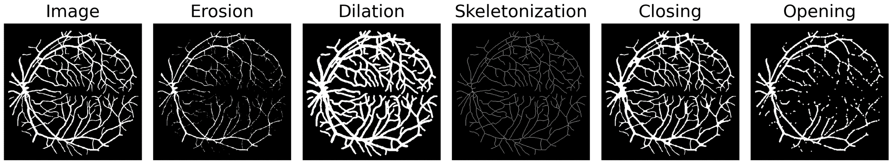

# Differentiable Soft Morphological Filters for Medical Image Segmentation

Accepted [paper](https://hal.science/hal-04592007) at **MICCAI 2024**

* [Abstract](#abstract)
* [Content](#content)
* [Usage](#usage)
* [Cite us](#citation)
* [Contact](#contact)


## Abstract
Morphological operations such as erosion, dilation, and skeletonization offer valuable tools for processing and analyzing segmentation masks. Several studies have investigated the integration of differentiable morphological operations within deep segmentation neural networks, particularly for the computation of loss functions. However, those methods have shown limitations in terms of reliability, versatility or applicability to different types of operations and image dimensions. In this paper, we present a novel framework that provides differentiable morphological filters on probabilistic maps. Given any morphological filter defined on 2D or 3D binary images, our approach generates a soft version of this filter by translating Boolean expressions into multilinear polynomials. Moreover, using proxy polynomials, these soft filters have the same computational complexity as the original binary filter. We demonstrate on diverse biomedical datasets that our method can be easily integrated into neural networks either as a loss function or as the final morphological layer in a segmentation network. In particular, we show that the proposed filters for mask erosion, dilation or skeletonization lead to competitive solutions compared to the state-of-the-art.



## Content
This repository contains the code for the soft and differentiable morphological filters used in the paper. 
* `SoftMorph2D.py` : 2D operations for Erosion, Dilation, Opening, Closing and Skeletonization
* `SoftMorph3D.py` : 3D operations for Erosion, Dilation, Opening, Closing and Skeletonization
* `example_usage.py` : example code to apply the soft morphological operations

## Usage
### Input image format
Input images should contain values in the range [0, 1]. Supported dimensions are :
* **2D** images of shape [batch_size, channels, heigth, width] or [height, width]
* **3D** images of shape [batch_size, channels, depth, heigth, width] or [depth, height, width]

### Application
The filters have been tested on  :
* Binary and continuous values ranging between [0, 1]
* In loss function
* As the final layer of a segmentation network

### Filters description
* ***SoftErosion*** : Erode the foreground 
    * <u>forward parameters</u> (*image* = input image, *iterations* = number of times the morphological operation is repeated, *connectivity* = structuring element [4, 8] in 2D and [6, 18, 26] in 3D)
* ***SoftDilation*** : Dilate the foreground
    * <u>forward parameters</u> (*image* = input image, *iterations* = number of times the morphological operation is repeated, *connectivity* = structuring element [4, 8] in 2D and [6, 18, 26] in 3D)
* ***SoftClosing*** : Dilation followed by an Erosion
    * <u>forward parameters</u> (*image* = input image, *iterations* = number of times each morphological operation is repeated, *dilation_connectivity* = structuring element [4, 8] in 2D and [6, 18, 26] in 3D for dilation operation, *erosion_connectivity* = structuring element for erosion)
* ***SoftOpening*** : Erosion followed by a Dilation
    * <u>forward parameters</u> (*image* = input image, *iterations* = number of times each morphological operation is repeated, *dilation_connectivity* = structuring element [4, 8] in 2D and [6, 18, 26] in 3D for dilation operation, *erosion_connectivity* = structuring element for erosion)
* ***SoftSkeletonizer*** : Repeated thinning operation to extract the centerline of the foreground
    * <u>init parameters</u> (*max_iter* = number of repeated thinning operation)
    * <u>forward parameters</u> (*image* = input image)


## Citation
To use in your research, please cite our paper:
```bibtex
@inproceedings{guzzi:hal-04592007,
  TITLE = {{Differentiable Soft Morphological Filters for Medical Image Segmentation}},
  AUTHOR = {Guzzi, Lisa and Zuluaga, Maria A. and Lareyre, Fabien and Di Lorenzo, Gilles and Goffart, S{\'e}bastien and Chierici, Andrea and Raffort, Juliette and Delingette, Herv{\'e}},
  URL = {https://hal.science/hal-04592007},
  BOOKTITLE = {{MICCAI 2024 - Medical Image Computing and Computer Assisted Intervention}},
  ADDRESS = {Marrakesh, Morocco},
  YEAR = {2024},
  MONTH = Oct,
  KEYWORDS = {Image Segmentation ; Morphological Operations ; Deep Learning},
  PDF = {https://hal.science/hal-04592007/file/Guzzi_MICCAI__Hal_Version.pdf},
  HAL_ID = {hal-04592007},
  HAL_VERSION = {v1},
}
```

Lisa Guzzi, Maria A. Zuluaga, Fabien Lareyre, Gilles Di Lorenzo, Sébastien Goffart, Andrea Chierici, Juliette Raffort, Hervé Delingette. Differentiable Soft Morphological Filters for Medical Image Segmentation. MICCAI 2024 - Medical Image Computing and Computer Assisted Intervention, Oct 2024, Marrakesh, Morocco. ⟨hal-04592007⟩


## Contact
For questions or inquiries, please contact Lisa Guzzi at lisa.guzzi@inria.fr 
